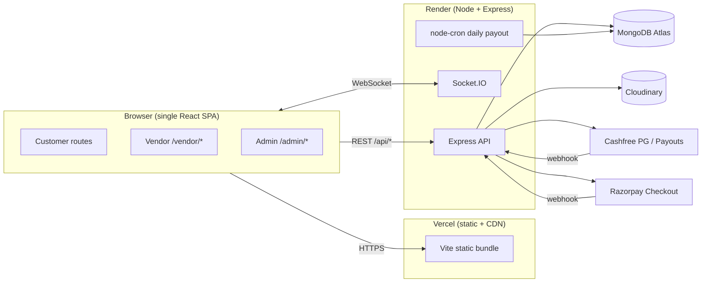
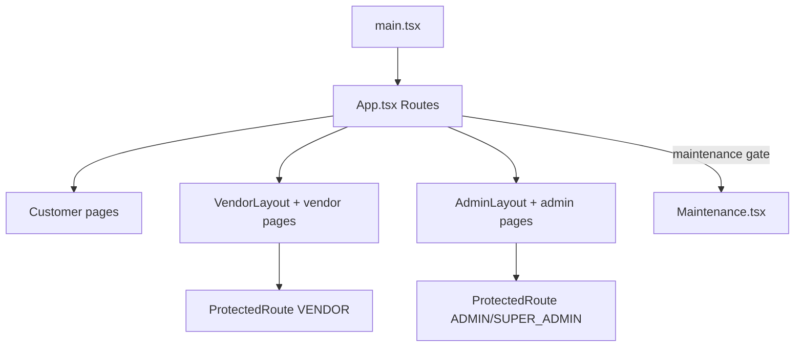
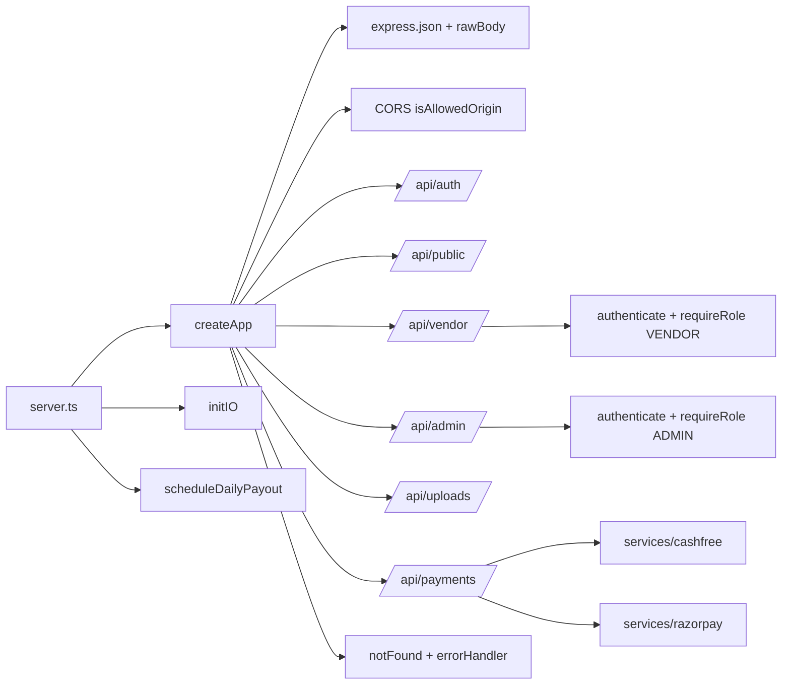
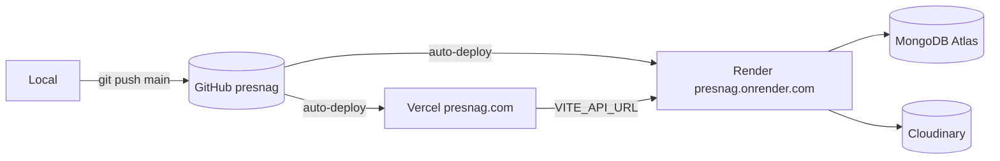
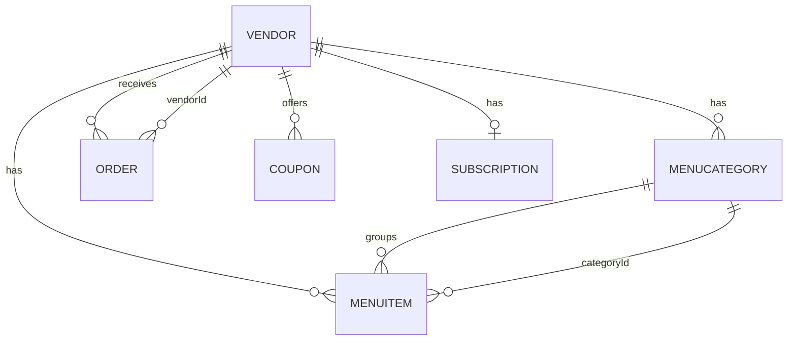
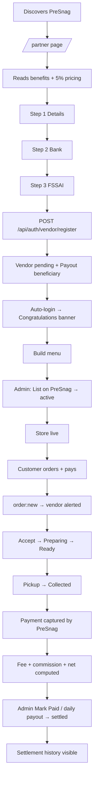
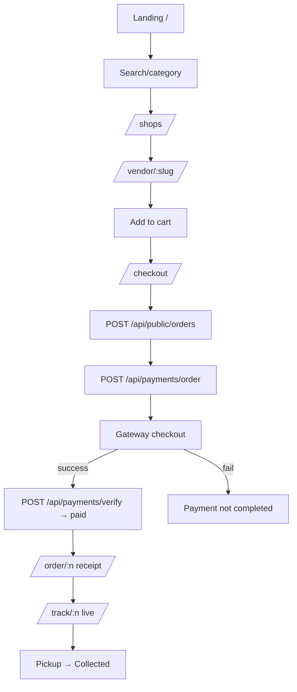

# PreSnag — Master Documentation (Single Source of Truth)

> **Version:** 1.0 · **Last updated:** June 2026
> **Status legend:** ✅ Implemented · 🟡 Partial / scaffolded · 🔭 Planned (not yet built)
> This document describes the system **as it actually exists in the codebase**. Where a capability is requested but not yet built, it is explicitly marked 🔭 so investors, auditors, and new engineers are never misled.

---

## Table of Contents

1. Executive Summary
2. Complete Architecture
3. Complete Tech Stack
4. Domain Structure
5. Database Documentation
6. Every User Journey
7. Complete Vendor Workflow
8. Complete Customer Workflow
9. Complete Admin Workflow
10. Payment System
11. Settlement Engine
12. APIs
13. Frontend
14. Backend
15. Security
16. Scalability
17. Monitoring & DevOps
18. Business Rules
19. Future Features
20. Complete Project Structure
21. Decision Log
22. Glossary

---

# 1. Executive Summary

## 1.1 What is PreSnag?

PreSnag is a **cloud-based, app-less order-ahead platform** for local food businesses — tea stalls, cafés, bakeries, juice corners, fast-food joints, and food courts. Customers browse a vendor, place and pay for an order from their browser (via a link or QR code), and pick it up when it's ready — **skipping the queue entirely**. Vendors manage menus, orders, and settlements from a web dashboard. A platform admin reviews vendors, monitors orders, and runs settlements.

The product tagline is **"Order Ahead. Skip The Queue."**

It is delivered as a **single React SPA** served under one domain (`presnag.com`) with **role-based routing**:
- Customer (public): `/`, `/shops`, `/vendor/:slug`, `/checkout`, `/order/:n`, `/track/:n`, `/partner`, `/about`, `/terms`, `/privacy`
- Vendor: `/vendor/*` (role `VENDOR`)
- Admin: `/admin/*` (role `ADMIN` / `SUPER_ADMIN`)

## 1.2 Vision

To become the default "order-ahead and skip-the-queue" layer for **every small, independent food outlet in India**, giving them the same pre-order convenience that large chains have — without forcing customers to download an app or vendors to buy expensive hardware.

## 1.3 Mission

Eliminate queue time for customers and lost sales for vendors by providing a lightweight, browser-first ordering experience that any local food business can adopt in minutes.

## 1.4 Problem Statement

- **For customers:** Queues waste time at peak hours; walking out is common when the line is long.
- **For vendors:** Lost sales during rush, no digital ordering, no customer data, and existing aggregators charge high commissions and require apps.
- **For the ecosystem:** Existing food platforms are delivery-centric, app-centric, and expensive — a poor fit for a chai stall or a college canteen that just wants pre-orders for pickup.

## 1.5 Solution

A **no-app, browser-first** pre-order system:
- Customer scans a QR / opens a link → sees the live menu → orders → pays online → gets an order number → tracks status live → collects.
- Vendor gets a real-time alert (sound + browser notification), prepares, and advances the order through statuses.
- Money is collected by PreSnag (managed settlement) and settled to the vendor's bank; PreSnag keeps a flat commission.

## 1.6 Business Model

PreSnag is a **B2B2C marketplace / SaaS hybrid**:
- **B2B:** onboard local food vendors who pay a per-order platform fee.
- **B2C:** customers order ahead for free (they pay exactly the item total, no surcharge).

Settlement model in production today is **PreSnag Managed**: PreSnag's payment-gateway account collects every payment, and the platform settles the vendor's net (after fees) to their bank — currently **manually** by the admin, with an **automated daily payout** path available when Cashfree Payouts is configured.

## 1.7 Revenue Model

**5% platform commission per order** (configurable constant `PLATFORM_FEE_RATE`).

Money flow per order (the vendor bears the gateway cost; PreSnag keeps the full commission as profit):

```
Customer Paid (total)
  − Gateway Fee (≈2.36% = 2% MDR + 18% GST)   → paid to Cashfree/Razorpay
  − Platform Commission (5%)                   → PreSnag revenue / net profit
  = Vendor Net (what the vendor receives)
```

> **History:** The model evolved from a flat **₹600/month subscription** to **5% per order**. The codebase, partner page, About/Terms, and the settlement engine all reflect the 5% model. (See Decision Log §21.)

## 1.8 Target Audience

- **Primary vendors:** tea/coffee stalls, cafés, bakeries, juice corners, fast food, food courts, North-Indian / multi-cuisine / healthy-food outlets (the `category` enum).
- **Customers:** anyone who wants to skip a queue — students, office crowds, walk-in pickup customers.
- **Geography:** India-first (₹ pricing, UPI-first checkout, Indian KYC: PAN / FSSAI / IFSC).

## 1.9 Future Roadmap (high level — see §19)

Delivery partners, loyalty/rewards, subscriptions, AI recommendations, franchise/enterprise tooling, native mobile apps, richer analytics, marketplace expansion.

---

# 2. Complete Architecture

## 2.1 High-Level Architecture

PreSnag is a **3-tier web application** plus two external payment gateways and a media CDN.



## 2.2 Low-Level Architecture

- **Frontend:** React 18 + Vite + TypeScript SPA. React Router v6 routing, TanStack Query for server state, Zustand for client state (auth, cart, sound), Tailwind styling, `socket.io-client` realtime, `recharts` charts, `lucide-react` icons.
- **Backend:** Express (TypeScript; `tsx` in dev, `tsc` in prod). Layered **routes → services → models**. Cross-cutting: `middleware/auth` (JWT + RBAC), `middleware/error` (async wrapper + central handler), `realtime/io` (Socket.IO), `jobs/dailyPayout` (cron), `config/*` (env, db, cloudinary, constants).
- **Database:** MongoDB via Mongoose. 8 collections (Admin, Vendor, Order, MenuCategory, MenuItem, Coupon, Setting, Subscription).
- **Payments:** Unified endpoints (`/api/payments/order`, `/verify`) dispatch to **Cashfree** or **Razorpay** based on the admin `paymentProvider` setting.

## 2.3 Frontend Architecture



- **App.tsx** is the route table and the **maintenance gate**: polls `GET /api/public/settings`; if `maintenanceMode` is on and the path is not `/admin/*`, renders `Maintenance.tsx` (so the owner can still log in and turn it off).
- **ProtectedRoute** redirects unauthenticated/unauthorized users to the relevant login.
- **Layouts:** `VendorLayout` / `AdminLayout` give the sidebar; `VendorLayout` hosts the **global new-order socket listener** (sound + toast + browser notification).

## 2.4 Backend Architecture



**Boot (`server.ts`):** create HTTP server → init Socket.IO → **bind the port first** (Render detects "live" before Mongo) → connect Mongo with retry/backoff → schedule the daily payout cron (only if Cashfree Payouts configured).

## 2.5 Database Architecture

MongoDB document store via Mongoose. Relationships by `ObjectId` reference; the app `populate()`s where needed. `Setting` is a **singleton** (one doc keyed `platform`). Full schemas + ER diagram in §5.

## 2.6 Deployment Architecture



- **Frontend:** Vercel (static, global CDN). Build env: `VITE_API_URL`, `VITE_SOCKET_URL`, `VITE_CASHFREE_ENV`.
- **Backend:** Render Web Service (Node). Runtime env: Mongo URI, JWT secret, `CLIENT_URL`, Cloudinary keys, Cashfree keys, Razorpay keys.
- **Uptime:** `/health` pinged by UptimeRobot keeps the free Render instance warm.

## 2.7 Security Architecture

- **AuthN:** JWT (HS256, 7-day) as `Authorization: Bearer`.
- **AuthZ:** `authenticate` decodes; `requireRole(...)` gates vendor/admin routers.
- **Passwords:** bcrypt (cost 10); never returned (`select("-passwordHash")`).
- **Webhooks:** HMAC verification (Cashfree SHA-256 base64; Razorpay SHA-256 hex).
- **Payment integrity:** orders **re-priced server-side**; client prices never trusted.
- **Demo-bypass guard:** `demo-confirm` disabled when any real gateway is configured.
- Detail in §15.

## 2.8 Payment Architecture

```mermaid
sequenceDiagram
  participant Cust as Customer
  participant FE as Frontend
  participant BE as Backend
  participant GW as Gateway
  Cust->>FE: Confirm Order
  FE->>BE: POST /api/public/orders (re-priced)
  BE-->>FE: order (pending)
  FE->>BE: POST /api/payments/order
  BE->>GW: create gateway order
  GW-->>BE: session/order id
  BE-->>FE: {provider, ids, keyId}
  FE->>GW: open checkout
  Cust->>GW: pays
  GW-->>FE: success
  FE->>BE: POST /api/payments/verify
  BE->>GW: verify status/signature
  BE->>BE: paid; emit order:new
  GW-->>BE: webhook (backup)
```

Active gateway chosen by admin (`Setting.paymentProvider`). Both collect into PreSnag's account (managed). See §10.

## 2.9 Vendor Settlement Architecture

Per order: platform fee (5%), gateway fee (~2.36%), vendor net. Paid managed orders accumulate as **pending settlement**; settled **manually** (admin Mark-Paid + UTR) or **automatically** (daily cron via Cashfree Payouts). See §11.

## 2.10 Notification Architecture

- **Realtime in-app:** Socket.IO. Rooms `vendor:<vendorId>`, `order:<orderNumber>`. Events `order:new` (vendor), `order:status` (vendor + tracking room).
- **Vendor alerting:** Web Audio chime (`lib/sound.ts`) + toast + browser Notification on a new paid order.
- 🔭 **SMS / WhatsApp / Email** not implemented.

## 2.11 File Storage / Image Upload Architecture

Images upload via `POST /api/uploads/image` (multer, in-memory) → **Cloudinary**. If keys absent → URL passthrough. Frontend: `ImageUpload` component.

## 2.12 Authentication Architecture

- **Vendor:** register; login by **email or 10-digit mobile** (phone is the unique id; email optional/sparse-unique).
- **Admin:** email + password.
- **Session:** `GET /api/auth/me` resolves the user from the JWT.

## 2.13 Authorization Architecture

`/api/vendor/*` → `requireRole("VENDOR")`; `/api/admin/*` → `requireRole("ADMIN","SUPER_ADMIN")`; `/api/public/*` & `/api/auth/*` open; `/api/payments/*` open for create/verify (anonymous customer), demo-confirm guarded.

## 2.14 API Architecture

REST/JSON over HTTPS, mounted under `/api`: `auth`, `public`, `vendor`, `admin`, `uploads`, `payments`, plus `GET /health` and `GET /`. Errors → central handler → `{ message }` + status. Catalogue in §12.

---

# 3. Complete Tech Stack

## 3.1 Frontend

| Tech | Ver | Why | Pros | Cons | Alternatives |
|---|---|---|---|---|---|
| React 18 | 18.3 | Mature, team familiarity | Ecosystem, hooks | Needs router/state libs | Vue, Svelte, Solid |
| Vite | 5.4 | Fast build/HMR | Instant, ESM | Env baked at build | Next.js, CRA |
| TypeScript | 5.6 | Shared types | Safety, IDE | Compile step | Plain JS |
| React Router | 6.28 | Role areas in one SPA | Nested routes | v7 warnings | TanStack Router |
| TanStack Query | 5.59 | Server-state cache | Dedupe, refetch | Concept overhead | SWR, RTK Query |
| Zustand | 5.0 | Minimal state + persist | Tiny | Less structure | Redux Toolkit |
| Tailwind | 3.4 | Fast styling, tokens | Consistency | Verbose classes | CSS Modules, MUI |
| recharts | 2.13 | Charts | Declarative | Bundle size | Chart.js |
| lucide-react | 0.456 | Icons | Tree-shake | — | react-icons |
| socket.io-client | 4.8 | Realtime | Reconnect | Heavier | native WS |

## 3.2 Backend

| Tech | Ver | Why | Pros | Cons | Alternatives |
|---|---|---|---|---|---|
| Express | 4.21 | Lightweight, ubiquitous | Middleware ecosystem | Manual structure | Fastify, NestJS |
| Mongoose | 8.8 | Schema over Mongo | Validation, populate | ODM overhead | Prisma, native driver |
| jsonwebtoken | 9.0 | Stateless auth | No session store | Revocation harder | sessions, Paseto |
| bcryptjs | 2.4 | Password hashing | Portable | Slower than native | argon2 |
| socket.io | 4.8 | Realtime | Rooms, fallbacks | Sticky at scale | ws, Pusher, Ably |
| multer | 2.1 | Upload parsing | Standard | In-memory buffers | busboy |
| cloudinary | 2.5 | Image CDN | Transforms | Lock-in | S3+CloudFront |
| node-cron | 4.2 | Daily payout | Simple in-proc | One instance | BullMQ, Agenda |
| qrcode | 1.5 | Store QR | Simple | — | qr-image |

## 3.3 Database — MongoDB Atlas ✅
Flexible documents, managed hosting, free tier. Pros: schema flexibility, JSON-native, scaling. Cons: no joins (app `populate`). Alternatives: PostgreSQL+Prisma, Firestore.

## 3.4 Hosting — Render (API) + Vercel (SPA) ✅
Render: easy Node deploys, auto-deploy, free tier (idle spin-down mitigated by `/health`). Vercel: best static/SPA + CDN. Alternatives: Railway, Fly.io, AWS, Netlify.

## 3.5 Storage — Cloudinary ✅ (passthrough fallback). Alternatives: S3+CloudFront, Supabase, Bunny.

## 3.6 Authentication — JWT + bcrypt ✅. Alternatives: Auth0/Clerk, server sessions.

## 3.7 Payment Gateways — Cashfree ✅ + Razorpay ✅ (admin-switchable). India-first UPI/cards; Cashfree adds Easy Split + Payouts; Razorpay adds modal checkout. Alternatives: PayU, Stripe (weak for India), PhonePe.

## 3.8 Realtime — Socket.IO ✅ (order alerts + live tracking).

## 3.9 Maps 🔭
Not integrated. "Nearby" uses the **Haversine formula** on stored `lat`/`lng` + browser Geolocation — no map tiles. Future: Google Maps/Mapbox.

## 3.10 Notifications
In-app realtime + chime + browser Notifications ✅. SMS 🔭 / WhatsApp 🔭 / Email 🔭 not implemented.

## 3.11 Analytics 🔭
In-product analytics (admin Analytics/Finance, vendor Reports) ✅; no third-party product analytics (GA4/PostHog) wired.

## 3.12 Email / SMS / WhatsApp 🔭 — only `mailto:` contact links today.

## 3.13 Cron Jobs — node-cron ✅ (daily payout 22:00, active only with Payouts keys).

## 3.14 CI/CD — git push → auto-deploy ✅; no test pipeline / Actions 🔭.

## 3.15 Monitoring — UptimeRobot `/health` ✅; no APM (Sentry/Datadog) 🔭.

## 3.16 Logging — console → Render logs ✅; no structured/shipped logs 🔭.

---

# 4. Domain Structure

## 4.1 Current ✅

| Host | Role | Platform |
|---|---|---|
| `presnag.com` / `www.presnag.com` | Frontend SPA (all roles, route-based) | Vercel |
| `presnag.onrender.com` | Backend API + Socket.IO | Render |

One SPA, one domain; roles separated by **path** (`/vendor/*`, `/admin/*`), not subdomain (deliberate — see §21).

## 4.2 Requested subdomains 🔭 (not implemented)
`api.`/`vendor.`/`admin.`/`partner.presnag.com` are **not** configured. Future: `api.` → CNAME to Render; role subdomains → Vercel rewrites/separate deploys (would require CORS + auth-domain changes).

## 4.3 SSL / DNS / CDN
- **SSL:** auto by Vercel + Render.
- **DNS:** apex/`www` → Vercel; API via the Render URL in `VITE_API_URL`.
- **CDN:** Vercel edge (bundle) + Cloudinary (images).
- **CORS allow-list** (`config/env.ts`): `CLIENT_URL`, `presnag.com`, `www.presnag.com`, `presnag.vercel.app`, any `*.vercel.app`, any `localhost:*` (dev).

## 4.4 Future mobile apps 🔭 — none; a future RN/Expo app could reuse the REST API + JWT.

---

# 5. Database Documentation

8 Mongoose collections; all `{ timestamps: true }` unless noted.

## 5.1 ER Diagram



## 5.2 `Admin`
**Purpose:** platform staff.
`name(req)`, `email(req,unique,lowercase)` (login), `passwordHash(req)`, `role(ADMIN/SUPER_ADMIN, default SUPER_ADMIN)`.
**Example:** `{ name:"Super Admin", email:"admin@presnag.com", role:"SUPER_ADMIN" }`. **Lifecycle:** seeded → login → JWT with role.

## 5.3 `Vendor`
**Purpose:** a food outlet.
| Field | Type | Notes |
|---|---|---|
| name | String (req) | shop name |
| ownerName | String | |
| slug | String (req, unique, idx) | `/vendor/:slug` |
| email | String (lowercase, sparse-unique) | optional |
| phone | String (req, unique) | 10-digit, **login id** |
| passwordHash | String (req) | bcrypt |
| description, address | String | |
| logo, banner | String | Cloudinary |
| fssaiLicense | String | |
| category | enum (Tea Stall…Healthy Food) | |
| openingHours | String | display |
| openTime, closeTime | String `HH:MM` | timings |
| isOpen | Boolean (default true) | |
| rating | Number (4.5) | display |
| prepTime | Number (15) | ETA |
| socialLinks | {instagram,facebook,website} | |
| status | enum pending/active/suspended/inactive (idx) | listing gate |
| subscriptionPlan | enum (legacy) | |
| settlementMode | enum MANAGED/DIRECT (idx) | |
| eligibleForDirectMigration | Boolean | banner |
| managedPayout | {accountHolderName,accountNumberLast4,ifsc,panMasked} | display-only |
| cashfreeBeneficiaryId | String | Payouts payee (MANAGED) |
| cashfreeVendorId | String | Easy Split sub-merchant (DIRECT) |
| kycStatus | enum not_started/in_progress/active/rejected | DIRECT |
| lat, lng | Number | Nearby |

**Indexes:** slug, phone (unique), email (unique sparse), status, settlementMode.
**Publicly live** ⇔ `status==="active"` AND (MANAGED → beneficiary present, or DIRECT → kyc active).
**Lifecycle:** register → pending → admin "List" → active → suspended/inactive. **Delete cascades** to menu/orders/coupons.

## 5.4 `Order`
| Field | Type | Notes |
|---|---|---|
| vendorId | ObjectId→Vendor (req, idx) | |
| orderNumber | String (req, unique, idx) | `PS-XXXXX` |
| customerName, customerPhone | String (req) | |
| note | String | |
| orderType | enum DINE_IN/TAKE_AWAY (DINE_IN) | |
| items | [{itemId,name,price,qty,instructions}] | snapshot |
| subtotal, tax, discount, total | Number | tax=0; total=subtotal−discount |
| couponCode | String | |
| paymentMethod | enum COD/RAZORPAY/CASHFREE (CASHFREE) | |
| paymentStatus | enum pending/paid | |
| gatewayOrderId | String | gateway order id |
| status | enum received/accepted/preparing/ready/collected/cancelled (idx) | |
| pickupTime | String | |
| settlementMode | MANAGED/DIRECT | snapshot |
| settlementStatus | enum not_applicable/pending/processing/settled/failed (idx) | |
| payoutId, settlementRef | String | UTR/payout id |
| settledAt | Date | |

**Lifecycle:** created pending → gateway → paid → vendor advances → collected. Managed paid → pending settlement → settled. Only **paid/COD** orders appear in vendor/admin (`PAID_FILTER`).

## 5.5 `MenuCategory` — `{ vendorId(req,idx), name(req), image, sortOrder }`.
## 5.6 `MenuItem` — `{ vendorId(req,idx), categoryId(req,idx), name(req), description, price(req), image, isAvailable(true) }`.
## 5.7 `Coupon` — `{ vendorId(req,idx), code(req,upper), type(percent/fixed), value, expiry, usageLimit, usedCount, isActive(true) }`.
## 5.8 `Setting` (singleton) — `{ key:"platform"(unique), maintenanceMode, paymentProvider(CASHFREE/RAZORPAY), demoBanner:{enabled,message,showOnHome,showOnCheckout} }`; via `getSettings()`.
## 5.9 `Subscription` 🟡 (legacy) — `{ vendorId, plan, amount, startDate, endDate, status }`; unused in the 5% model.

---

# 6. Every User Journey

## 6.1 Customer ✅
No account. Home → search/browse → vendor → cart → checkout (name, phone, order type, pay) → confirmation (order number) → live tracking → pickup. Can only create/track orders by number. Errors: empty-cart guard, store-closed guard, **failed-payment** screen, invalid-coupon toast.

## 6.2 Vendor ✅
Register (3-step) → login (email/mobile) → dashboard (status banner + stats) → manage menu, orders, payments, QR, coupons, reports, settings. Strictly scoped to own `vendorId`; store hidden until `active`.

## 6.3 Admin ✅
Login → Overview (stats, maintenance toggle, gateway toggle, demo banner, settlements) → Vendors (approve/suspend/delete, reset password, clear orders) → Orders (monitor, clear history) → Finance → Analytics.

## 6.4 Delivery Partner 🔭 — not implemented (pickup-only).

## 6.5 Founder — operates via SUPER_ADMIN. Daily loop: review/list vendors → Finance → settle vendors (Mark Paid + UTR) → monitor orders.

---

# 7. Complete Vendor Workflow



**Step detail (who / API / DB / UI):**
1. **Partner page** (`/partner`, `Partner.tsx`) — marketing; no API.
2. **Register Step 1 – Details:** Shop Name, Owner Name, Mobile(req), Email(optional), Password, Address, Category, Open/Close Time.
3. **Step 2 – Settlement:** Account Holder, Account Number, IFSC, PAN (req). **Direct = "Available soon" (disabled)**; MANAGED forced.
4. **Step 3 – FSSAI:** license number (req). No GST/Udyam/photos.
5. **`POST /api/auth/vendor/register`:** validate all steps, dedupe phone/email, unique slug, hash password, create Vendor (pending, MANAGED), create Cashfree Payouts beneficiary (simulated if keys absent), store masked payout + `cashfreeBeneficiaryId`; return JWT (auto-login).
6. **Dashboard (pending):** `Dashboard.tsx` + `GET /api/vendor/me` → **Congratulations / verified within 24h** banner.
7. **Menu:** `Menu.tsx` → `/api/vendor/categories`, `/api/vendor/items`, image via `/api/uploads/image`.
8. **Admin list:** `Vendors.tsx` → `PATCH /api/admin/vendors/:id/status = active` (enabled once payout-ready). Now passes the public live filter.
9. **Orders:** `received→accepted→preparing→ready→collected` via `PATCH /api/vendor/orders/:id/status` → emits `order:status` to the tracking room.
10. **Settlement:** §11; vendor sees the breakdown on `/vendor/payments`.

---

# 8. Complete Customer Workflow



- **Home (`Home.tsx`):** separate Mobile/Desktop layouts; hero, search, category tiles, featured + nearby (Haversine), how-it-works, admin **demo banner**.
- **Shops (`Shops.tsx`):** `GET /api/public/vendors?q=&category=`.
- **Vendor page (`VendorPage.tsx`):** `GET /api/public/vendors/:slug`; cart (Zustand, single-vendor, persisted).
- **Checkout (`Checkout.tsx`):** name, phone, **order type**, coupon (`POST /api/public/vendors/:slug/coupon`), online payment. Total = subtotal − discount.
- **Order create:** `POST /api/public/orders` — server re-prices, applies coupon, creates pending order, returns `orderNumber`.
- **Payment:** `POST /api/payments/order` → checkout → `POST /api/payments/verify` → paid → vendor alerted.
- **Confirmation (`OrderConfirmation.tsx`):** verifies on load; printable receipt; **if unpaid → "Payment not completed"** + Try Again.
- **Tracking (`OrderTracking.tsx`):** joins `order:<n>` room; status stepper; refuses unpaid orders.
- **History / Reviews / Profile** 🔭 — not implemented (orders by number; no customer accounts).

---

# 9. Complete Admin Workflow

- **Login:** `POST /api/auth/admin/login` → JWT.
- **Overview (`Overview.tsx`):** `GET /api/admin/overview`; cards: **Maintenance**, **Payment Gateway** (Cashfree/Razorpay), **Demo Banner** (enable/preset/placement), **Settlements** (per-vendor net + Mark Paid).
- **Vendors (`Vendors.tsx`):** approval queue + detail modal (owner, mobile, FSSAI, timings, bank); **List on PreSnag**; suspend/activate; **Reset Password**; **Clear Orders**; **Delete** (cascade).
- **Orders (`Orders.tsx`):** `GET /api/admin/orders` (paid filter); filter status/date; **Clear All History**.
- **Finance (`Finance.tsx`):** `GET /api/admin/finance?date=` — per-order Paid/Gateway/Platform/Vendor Gets + totals.
- **Analytics (`Analytics.tsx`):** `GET /api/admin/analytics` — daily revenue/orders, top vendors, MRR/ARR.
- **Refunds / Customer mgmt / Menu moderation / Support** 🔭 — not implemented.

---

# 10. Payment System

## 10.1 Providers & switching ✅
`Setting.paymentProvider` (admin, default CASHFREE) picks the active gateway; both collect into PreSnag's account. `VITE_CASHFREE_ENV` picks Cashfree sandbox/prod for the JS SDK.

## 10.2 Unified flow
- `POST /api/payments/order { orderNumber }`:
  - **Cashfree:** `createPgOrder` (Easy-Split 100% to vendor if DIRECT+verified, else no split) → `{ provider:"CASHFREE", paymentSessionId }`.
  - **Razorpay:** `createRazorpayOrder` → `{ provider:"RAZORPAY", razorpayOrderId, amount, currency, keyId }`; stores `gatewayOrderId`.
- `POST /api/payments/verify { orderNumber, razorpay* }`:
  - **Razorpay:** verify HMAC (`order_id|payment_id` with key secret); fallback fetch captured payment.
  - **Cashfree:** `getPgOrderStatus` (PAID).
  - Paid → `emitNewOrder` + `emitOrderStatus`.

## 10.3 Cashfree ✅
PG `…/pg`, version `2023-08-01`, `x-client-id`/`x-client-secret`. Hosted redirect (return URL must be https in prod). Webhook `POST /api/payments/cashfree/webhook` (HMAC base64 of `timestamp+rawBody` with client secret); handles PAYMENT_SUCCESS + Easy-Split vendor onboarding status.

## 10.4 Razorpay ✅
Orders API + HTTP Basic. **Modal** checkout (no return-URL constraint; works on localhost). Handler returns `payment_id/order_id/signature` → verified. Webhook `POST /api/payments/razorpay/webhook` (HMAC hex of rawBody with `RAZORPAY_WEBHOOK_SECRET`); confirms `payment.captured`/`order.paid`.

## 10.5 Success / failure / abandonment
Success → paid + alert + receipt. Failure/abandon → order stays pending, **"Payment not completed"** screen (no ticket), hidden from vendor/admin, **cart kept** for retry (a retry creates a fresh order — no gateway-id collision).

## 10.6 Webhooks & signatures ✅
Raw body captured in `express.json({ verify })`. Both webhooks idempotent via `confirmPaid`.

## 10.7 Refunds 🔭 — issued from the gateway dashboard (no in-app endpoint).

## 10.8 Payout flow
MANAGED (today): collect → manual settle (Mark Paid + UTR) or daily cron (Payouts). DIRECT (Easy Split): 100% per-order split — available via vendor migration but **disabled at registration**.

## 10.9 Retry / failed payouts
Automated payout failures → `settlementStatus: failed`, surfaced to admin; idempotent transfer id per vendor per day prevents double payout.

## 10.10 Audit trail
Per-order `paymentStatus`, `gatewayOrderId`, `settlementStatus`, `settledAt`, `settlementRef`, `payoutId`. 🔭 No separate ledger collection.

---

# 11. Settlement Engine

## 11.1 Constants (`config/constants.ts`)
`PLATFORM_FEE_RATE = 0.05`, `GATEWAY_FEE_RATE = 0.0236`.

## 11.2 Formulas (per order, 2-decimal)
```
platformFee(total) = round2(total × 0.05)
gatewayFee(total)  = round2(total × 0.0236)
vendorNet(total)   = round2(total − platformFee − gatewayFee)
netProfit          = platformFee   (vendor bears the gateway fee)
```

## 11.3 Examples
| Paid | Gateway | Platform (5%) | Vendor Gets |
|---|---|---|---|
| ₹100.00 | ₹2.36 | ₹5.00 | ₹92.64 |
| ₹250.00 | ₹5.90 | ₹12.50 | ₹231.60 |

Daily totals: Collection ₹18,500 · Gateway ₹420 · Commission ₹925 · **Vendor Payout Due ₹17,155** · **Net Profit ₹925**.

## 11.4 States
Gross/Net per order computed live; **Pending** = managed paid orders not yet settled; **Settled** = `settlementStatus:settled` + `settledAt` + `settlementRef`.

## 11.5 Manual (today)
Overview → Settlements → **Mark Paid** (`POST /api/admin/settlements/:vendorId/mark-paid { reference }`) → marks pending orders settled, stamps date + UTR.

## 11.6 Automatic
`jobs/dailyPayout.ts` at 22:00 → per managed vendor, one Cashfree Payouts transfer → settled. **Disabled** without Payouts keys (manual mode).

## 11.7 History — per-order status/date/ref powers the vendor Payments table + admin Finance page.

---

# 12. APIs

Base: `https://presnag.onrender.com` (prod) / `http://localhost:5008` (dev). JSON. Auth = `Authorization: Bearer <jwt>`.

## 12.1 Health — `GET /`, `GET /health` → `{ ok, service, uptime, timestamp }`.

## 12.2 Auth (`/api/auth`)
| Method | Path | Auth | Body |
|---|---|---|---|
| POST | `/vendor/register` | – | name, ownerName, phone, email?, password, address, category, openTime, closeTime, accountHolderName, accountNumber, ifsc, pan, fssaiLicense |
| POST | `/vendor/login` | – | identifier, password |
| POST | `/admin/login` | – | email, password |
| GET | `/me` | JWT | – |

## 12.3 Public (`/api/public`)
`GET /settings`, `GET /vendors?q=&category=`, `GET /vendors/:slug`, `POST /vendors/:slug/coupon`, `POST /orders`, `GET /orders/:orderNumber`.

## 12.4 Vendor (`/api/vendor`, VENDOR)
`GET/PUT /me`, `POST /change-password`, `GET /stats`, `GET /orders`, `PATCH /orders/:id/status`, `DELETE /orders`, `GET/POST /categories`, `PUT/DELETE /categories/:id`, `GET/POST /items`, `PATCH /items/:id/availability`, `PUT/DELETE /items/:id`, `GET/POST /coupons`, `PUT/DELETE /coupons/:id`, `GET /qr`, `GET /reports`, `GET /settlement`, `POST /settlement/managed`, `POST /settlement/switch-direct`, `POST /settlement/complete-demo-kyc`.

## 12.5 Admin (`/api/admin`, ADMIN/SUPER_ADMIN)
`GET/PUT /settings`, `GET /overview`, `GET /finance?date=`, `GET /settlements`, `POST /settlements/:vendorId/mark-paid`, `POST /settlements/run`, `GET/POST /vendors`, `PATCH /vendors/:id/password`, `PUT /vendors/:id`, `PATCH /vendors/:id/status`, `DELETE /vendors/:id` (cascade), `GET /orders`, `DELETE /orders?vendorId?`, `GET /analytics`.

## 12.6 Payments (`/api/payments`)
`POST /order`, `POST /verify`, `POST /cashfree/order`, `POST /cashfree/verify`, `POST /cashfree/demo-confirm` (guarded), `POST /cashfree/webhook`, `POST /razorpay/webhook`.

## 12.7 Uploads — `POST /api/uploads/image?folder=` (multipart `image`) → `{ url }`.

**Errors:** 400 (validation), 401 (auth), 403 (role/guard), 404 (not found), 409 (duplicate) — via the central handler returning `{ message }`.

---

# 13. Frontend (per page)

**Customer:** Home, Shops, VendorPage, Checkout, OrderConfirmation, OrderTracking, Partner, StaticPages (About/Terms/Privacy), Maintenance.
**Vendor:** VendorLogin, VendorRegister (3-step), VendorLayout (sidebar + global order socket), Dashboard, Orders, Payments, Menu, Settings, QR, Coupons, Reports.
**Admin:** AdminLogin, AdminLayout, Overview, Vendors, Orders, Finance, Analytics.

Each page uses **ui components** (Button/Input/Card/Modal/Badge/Spinner/Toast) + feature components (VendorCard, ImageUpload, SiteHeader, PublicFooter, DemoBanner), **hooks** (useQuery/useMutation + Zustand), **state** (server cache + local form), **navigation** (React Router), **API** (`lib/api.ts`), **loading** (Spinner), **errors** (toast), **permissions** (ProtectedRoute).

**Stores:** authStore (user+token), cartStore (single-vendor cart), soundStore (alert on/off) — all Zustand + persist.
**Libs:** api, socket, sound (Web Audio + Notifications), cashfree/razorpay (SDK loaders), utils (`cn`, `rupees`, `timeAgo`), types.

---

# 14. Backend (per module)

```
config/    env, db, cloudinary, constants(fee rates+helpers)
middleware/ auth(authenticate+requireRole), error(asyncH+handler+HttpError)
models/    Admin, Vendor, Order, MenuCategory, MenuItem, Coupon, Setting, Subscription
realtime/  io (Socket.IO, rooms, emitNewOrder/emitOrderStatus)
routes/    auth, public, vendor, admin, payment, upload
services/  cashfree(PG+EasySplit+Payouts), razorpay(orders+verify+webhook)
jobs/      dailyPayout (cron + runManagedSettlement)
utils/     auth(hash/compare/sign/verify), helpers(slugify, genOrderNumber)
app.ts     Express assembly (CORS, JSON+rawBody, routes, health, errors)
server.ts  listen-first boot, Mongo retry, start cron
seed.ts    wipe + seed admin + demo vendors (0 orders)
```
Route files are thin controllers over models/services; payments hold the only substantial route-level business logic; everything else is CRUD scoped by `vendorId`.

---

# 15. Security

- **JWT:** HS256, 7-day, `{id,role}`; verified in `authenticate`. 🔭 No refresh/revocation list.
- **Passwords:** bcrypt(10); never serialized.
- **RBAC:** `requireRole`; vendor queries scoped to `req.user.id`.
- **CORS:** explicit allow-list + `*.vercel.app` + localhost.
- **Input validation:** required-field checks; phone normalized; PAN/IFSC upper-cased; **orders/coupons re-priced server-side**.
- **Webhook verification:** HMAC (base64/hex); raw body captured.
- **Payment-bypass guard:** `demo-confirm` 403 when any real gateway is configured.
- **Secrets:** `.env` (gitignored) + Render/Vercel env; never committed.
- **NoSQL injection:** Mongoose casting + typed queries.
- 🔭 **Rate limiting, Helmet, XSS-sanitizer, CSRF tokens** not added (SPA + Bearer auth lowers CSRF risk; React escapes output; still recommended — §19).

---

# 16. Scalability

| Scale | Bottlenecks | Mitigations |
|---|---|---|
| 20 (today) | none | single Render + Atlas free |
| 100 | cold starts, image bandwidth | keep-warm (done), Cloudinary CDN (done), paid Render |
| 1,000 | single Socket.IO/cron node, indexes | Redis socket adapter, dedicated payout worker/cloud scheduler, compound indexes |
| 10,000 | API throughput, hot vendors, batch payouts | horizontal API + LB, BullMQ queue, read replicas/sharding, edge cache public pages, dedicated analytics store |

Cross-cutting: Redis cache for public lists/settings; pre-computed finance/analytics rollups; split payments/settlement into a service at high volume.

---

# 17. Monitoring & DevOps

- **Hosting:** Render (API), Vercel (SPA), Atlas (DB), Cloudinary (media).
- **Deploy:** push `main` → auto-build both; empty commit can force a rebuild.
- **Env:** Render (backend secrets), Vercel (`VITE_*`, baked at build → redeploy after change).
- **Health:** `/health` + UptimeRobot keep-warm.
- **Logs:** Render/Vercel consoles. 🔭 No aggregation/APM.
- **Backups:** Atlas snapshots (managed). 🔭 No app export.
- **Cron:** in-process node-cron (single instance).
- 🔭 **CI tests, alerting, rollback automation** absent (rollback = redeploy a previous commit/deployment).

---

# 18. Business Rules

1. Customers pay exactly the item total (`tax=0`); only coupons reduce it.
2. Commission = 5% of total; gateway fee (~2.36%) borne by the vendor; **net profit = commission**.
3. A vendor is listable only when `active` **and** payout-ready; admin does the final "List on PreSnag".
4. Only paid (or COD) orders count anywhere (`PAID_FILTER`); failed/abandoned are invisible.
5. The vendor is alerted only after payment succeeds.
6. Default settlement = MANAGED; Direct disabled at registration ("Available soon").
7. Settlement is manual by default; auto payout runs only with Cashfree Payouts keys.
8. Phone is the unique vendor login; email optional.
9. Closed shops can't take orders; `isOpen` defaults true.
10. Maintenance mode blocks all non-`/admin` routes.
11. Deleting a vendor cascades to its menu/orders/coupons.
12. Demo banner is admin-controlled and off by default.

---

# 19. Future Features

Refunds/disputes · customer accounts/history/reviews/loyalty · delivery partners · subscriptions (re-add) · AI recommendations · franchise/enterprise · native mobile apps · richer analytics · security hardening (rate limiting, Helmet, zod, audit ledger, refresh tokens) · notifications (SMS/WhatsApp/email) · maps (autocomplete/directions). All 🔭.

---

# 20. Complete Project Structure

```
PreSnag/
├── plan.md                  # Cashfree/settlement plan
├── MasterDoc.md             # THIS document
├── README.md
├── backend/
│   ├── .env / .env.example
│   ├── package.json
│   └── src/
│       ├── app.ts           # Express assembly (CORS, JSON+rawBody, routes, health, errors)
│       ├── server.ts        # boot: listen-first, Mongo retry, start cron
│       ├── seed.ts          # wipe + seed admin + demo vendors (0 orders)
│       ├── config/          # env, db, cloudinary, constants(fee rates)
│       ├── middleware/      # auth, error
│       ├── models/          # Admin, Vendor, Order, MenuCategory, MenuItem, Coupon, Setting, Subscription
│       ├── realtime/io.ts   # Socket.IO rooms + emitters
│       ├── routes/          # auth, public, vendor, admin, payment, upload
│       ├── services/        # cashfree, razorpay
│       ├── jobs/dailyPayout.ts
│       └── utils/           # auth, helpers
└── frontend/
    ├── .env / .env.example  # VITE_API_URL, VITE_SOCKET_URL, VITE_CASHFREE_ENV
    ├── package.json
    ├── index.html
    └── src/
        ├── main.tsx          # React root + QueryClient + Router
        ├── App.tsx           # routes + maintenance gate
        ├── customer/         # Home, Shops, VendorPage, Checkout, OrderConfirmation,
        │                     # OrderTracking, Partner, StaticPages, Maintenance
        ├── vendor/           # VendorLogin, VendorRegister, VendorLayout, Dashboard,
        │                     # Orders, Payments, Menu, Settings, QR, Coupons, Reports
        ├── admin/            # AdminLogin, AdminLayout, Overview, Vendors, Orders, Finance, Analytics
        ├── components/       # ui/, ProtectedRoute, SiteHeader, PublicNav, VendorCard,
        │                     # ImageUpload, DemoBanner
        ├── store/            # authStore, cartStore, soundStore
        └── lib/              # api, socket, sound, cashfree, razorpay, utils, types
```

---

# 21. Decision Log

| # | Decision | Why | Alternatives | Trade-offs / migration |
|---|---|---|---|---|
| D1 | Single SPA, route-based roles (not subdomains) | One deploy/SSL/session, ship fast | vendor./admin. subdomains | Split later (CORS + auth-domain changes) |
| D2 | MongoDB over SQL | Flexible menus/orders, free tier | Postgres+Prisma | App enforces integrity (cascades) |
| D3 | JWT (no sessions) | Stateless, scales | sessions, Auth0 | No revocation; add refresh later |
| D4 | Managed settlement | Onboard instantly w/o per-vendor KYC | Direct split only | PreSnag holds funds → licensed rails; manual today |
| D5 | 5% per order (was ₹600/mo) | Cost ∝ vendor success | Flat subscription | `Subscription` now legacy |
| D6 | Dual gateway + admin toggle | Redundancy + Razorpay modal | Single gateway | Unified `/order`+`/verify` abstract it |
| D7 | Listen-first boot + Mongo retry | Render marks live before DB | Connect-then-listen | DB routes briefly fail until connected |
| D8 | Re-price every order server-side | Prevent tampering | Trust client | Slight extra reads; essential |
| D9 | Verify-on-return + webhook | Localhost-friendly; webhook is prod backstop | Webhook only | Two idempotent paths |
| D10 | Email optional, phone unique login | Vendors often lack email | Email-only | Sparse-unique email; login by either |

---

# 22. Glossary

- **SPA** — Single Page Application.
- **JWT** — signed token proving identity/role (Bearer header).
- **RBAC** — Role-Based Access Control (VENDOR/ADMIN/SUPER_ADMIN).
- **ODM** — Object-Document Mapper (Mongoose).
- **MANAGED settlement** — PreSnag collects + pays vendors out.
- **DIRECT settlement** — Cashfree Easy Split routes money to the vendor per order (disabled at registration today).
- **MDR** — gateway's per-transaction fee (~2% + 18% GST ≈ 2.36%).
- **Platform fee / commission** — PreSnag's 5% per order = net profit.
- **Vendor net** — total − gateway fee − platform fee.
- **Pending settlement** — paid managed orders not yet paid out.
- **UTR** — bank transfer reference (stored as `settlementRef`).
- **Payout beneficiary** — vendor's Cashfree Payouts payee.
- **Easy Split** — Cashfree split-settlement (DIRECT).
- **Sparse-unique index** — uniqueness only when the field is present (optional email).
- **PAID_FILTER** — query including only paid/COD orders in vendor/admin views.
- **Singleton setting** — the single `Setting` doc keyed `platform`.
- **Haversine** — great-circle distance for "Nearby".
- **Cold start** — delay when Render's free instance wakes (mitigated by `/health`).
- **Webhook** — gateway→server payment callback, HMAC-verified.
- **Idempotent** — safe to run more than once (payment confirmation, payouts).

---

*End of Master Documentation. For exact implementation always defer to the source code; this document is kept in sync and marks unbuilt capabilities with 🔭.*
